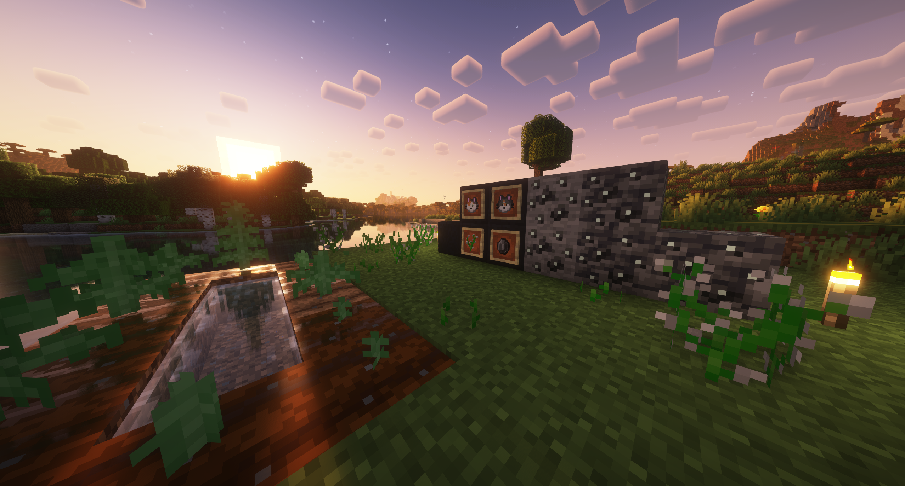
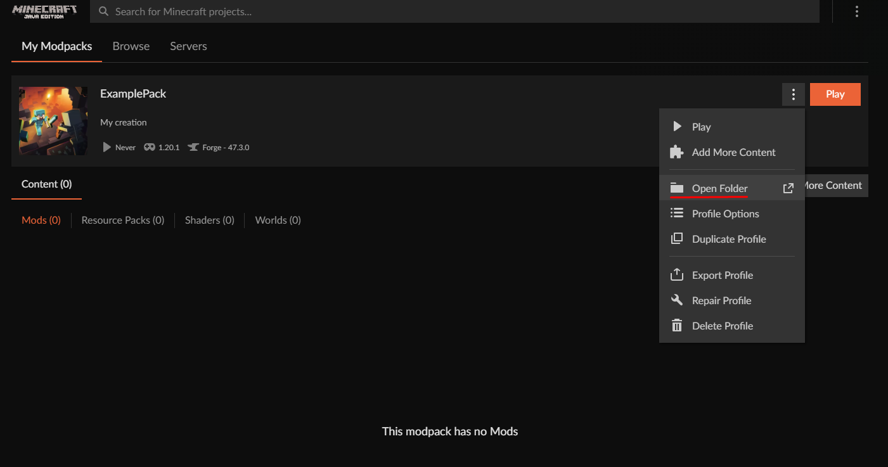
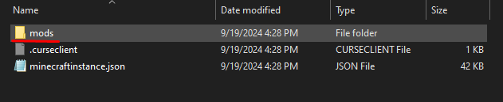

<h3 align="center">Baleful Herbs & Spices</h3>

  

    A minecraft mod that adds unique new crops and ores.
     
     
    <a href="https://github.com/bennettbDEV/HerbsAndSpices-1.20.1/issues/new?labels=bug&template=bug-report---.md">Report Bug</a>
    ·
    <a href="https://github.com/bennettbDEV/HerbsAndSpices-1.20.1/issues/new?labels=enhancement&template=feature-request---.md">Request Feature</a>
  

<!-- ABOUT THE PROJECT -->
## About The Project

  

As a programmer and a huge fan of countless Minecraft mods, I figured it's about time I make my own mod. 
    

Farming is a relaxing and satisfying part of Minecraft, but I wanted to change things up a bit and add harsh consequences 
for the crops I add. 
 

<h3>Some basic things to know </h3>
- Kemp seeds can be obtained by breaking grass - with a small chance that the seeds actually drop
- Silver Speedberry naturally generates in the world and can be found in the plains biome
- Idonite generates naturally and can be found at any y-level under 40

### Built With

* <a href="https://files.minecraftforge.net/net/minecraftforge/forge/">Forge</a>

<!-- GETTING STARTED -->
## Setup

(Note that I will publish the mod to CurseForge upon reaching version 1.0)
 
For now, you can install and use the mod by following these steps:

- Download balefulherbs-0.X-1.20.1.jar from the root directory of this project
- (Option 1) If you don't have Forge 1.20.1 installed already check out <a href="https://www.youtube.com/watch?v=VEyGJSE0XD8">this guide</a>
  - Then navigate to your mods folder and place the downloaded jar file within it
- (Option 2) You can also add the jar file to an existing modpack using a modloader such as Curseforge
  - Open/Create a 1.20.1 modpack in CurseForge select it
  - Click on the three dots next to "Play"
  - Click on "Open Folder" 
  - The folder will open and from there you can drop the balefulherbs-0.X-1.20.1.jar file into the mods folder 

<!-- ROADMAP -->
## Roadmap

- [X] **Add bad aftereffects for edible crops/ores**
- [ ] **Add consequence/crave system for edible crops/ores**
- [ ] Add custom Outcast villager's house generation
- [ ] Create mouse model
  - [ ] Add mouse mob
  - [ ] Add mouse behavior that effects crop growth
- [ ] Add more crops/flowers
- [ ] Add more ores/minerals
- [ ] Add vat to store liquid ores
  - [ ] Modify Idonite so that it can be liquified
- [ ] Update textures

See the [open issues](https://github.com/bennettbDEV/HerbsAndSpices-1.20.1/issues) for a full list of proposed features (and known issues).

<!-- CONTACT -->
## Contact

Bennett B. - bennettbeltran1@gmail.com - [Linkedin](https://linkedin.com/in/bennettbeltran)

<!-- ACKNOWLEDGMENTS -->
## Acknowledgments

While developing this mod, I initially followed videos by Kaupenjoe to learn the basics of modding with Forge. Many simple parts of this mod
were made from those videos, so I urge you to check them out.
* [Modding by Kaupenjoe](https://youtube.com/playlist?list=PLKGarocXCE1H9Y21-pxjt5Pt8bW14twa-&si=zEd4RQ5OYDaMk6O2)
* [Forge Documentation](https://docs.minecraftforge.net/en/1.20.x/)
* [README-Template](https://github.com/othneildrew/Best-README-Template)

(<a href="#readme-top">back to top</a>)

